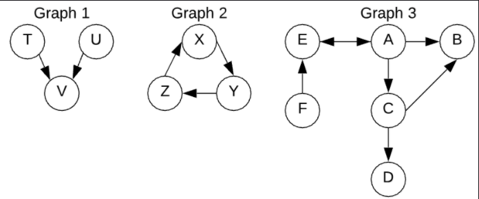
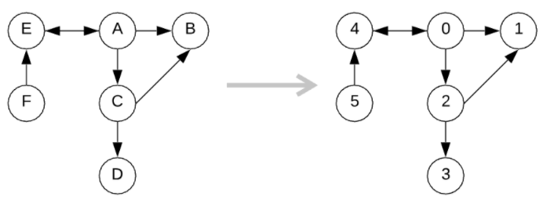

# Graphs
A **graph** is **any** collection of nodes and edges 
* an **edge** is anything that connects a node 

A graph is much more relaxed than other types of trees such that it may:
* lack a root node
* have cycles (e.g. child points back to root node)
  * i.e. can be a multidirectional tree
* have any number edges leaving a node (i.e. one node can point to 0..Inifnity other nodes)


## Adjacency Matrix Implementation 
Using a 2D array we can map out each node and and their direct edges. The values of the array will be a boolean indicating whether we can traverse from one node directly to the other. 

Here's an example: 


```js
let matrix = [
/*          A       B       C       D       E       F   */
/*A*/    [true,  true,   true,   false,  true,   false],
/*B*/    [false, true,   false,  false,  false,  false],
/*C*/    [false, true,   true,   true,   false,  false],
/*D*/    [false, false,  false,  true,   false,  false],
/*E*/    [true,  false,  false,  false,  true,   false],
/*F*/    [false, false,  false,  false,  true,   true]
]
```
Let's say we wanted to find if C has an edge connecting B. We can just refer to slot in matrix[2][1] to see if we have an edge connecting C to B. IT IS IMPORTANT to understand that matrix[2][1] is FROM C TO B. Not the other way around!! If we look at matrix[1][2] we get false. 

Pros:
* Can refer to the entire graph just from the matrix
Cons:
* Dam does it take up space. For *N* nodes we need *N<sup>2</sup>* space. 
* If we have very few edges, most of the matrix would be filled with false values. 

## Adjacency List Implementation
We can also use an object that stores nodes as keys and an array of adjacent nodes as values. The space required is going to be the number of edges in the graph. Worse case there will be N<sup>2</sup> edges where every node points to all other nodes.

```js
let graph = {
  'a': ['b', 'c', 'e'],
  'b': [],
  'c': ['b', 'd'],
  'd': [],
  'e': ['a'],
  'f': ['e']
};
```